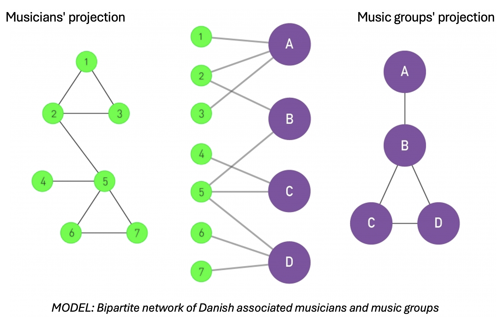

#  More about the website

 This part of the assignment is quite free. The main point of the website is to present your idea/analyses to the world in a way that showcases your use of what you've learned in class. It can be as simple as an old fashioned static web-page, and as complicated as you want it to be. Let your creativity run wild (but keep in mind that this is not a coding class - we care mostly about content and analysis). 

 The website should be self-contained and tell the story of your dataset without the need for the Explainer Notebook (the purpose of the notebook is to provide additional details for interested readers). Here are some requirements 

- [ ]  The page should say clearly what the dataset is and give the reader some idea of its most important properties (kind of Project Assignment A-style).
- [ ]  The page should contain your network and text analysis (that's the main part).
- [ ]  There should be download options for data sets (so the user can play around).
- [ ]  You must link to the Explainer Notebook (more details below) that explains the details of your analysis (including all of the machine learning, the model selection, etc). You can achieve this with a link to a notebook displaying on the nbviewer.
- [X]  For hosting, I recommend using your DTU website or Github pages.
# Table of contents
- [Introduction](#introduction)
- [The dataset](#the-dataset)
- [Network and text analysis](#network-and-text-analysis)
  - [Basic characteristics of the network](#basic-characteristics-of-the-network)
  - [Attribute analysis (genre)](#attribute-analysis-genre)
  - [Community detection](#community-detection)

# Introduction

For this assignment, we investigate the structure of Denmark’s local music scene by building a network that connects musicians to the bands they play with. '
Our goal is to uncover patterns of collaboration, reveal how creative communities form, and perhaps highlight key individuals and groups that act as bridges across different scenes or genres.

To do this, we constructed a bipartite network - a special kind of network made up of two different types of nodes: musicians and bands. 
In our network, musicians are only connected to bands (and not to other musicians directly), and bands are only connected to musicians. From this, we can create two useful views: one where bands are linked if they share members, and another where musicians are linked if they’ve played in the same band.

We collected data on Danish music groups by going through all relevant categories on the Danish Wikipedia, and gathered information about group members either from Wikipedia pages or the music database Discogs when needed. 
Once this data was cleaned and merged, we used it to build the network.

Focusing on Denmark keeps the scope of the project manageable while still offering meaningful insights. 
The final outcome will be this interactive website, where you can explore how artists and bands are interconnected. 

# The Dataset
This project looks into the network of danish music groups, defined by their shared members. All danish music groups are collected from the danish Wikipedia though running thorug all wiki categories of danish groups. The members of the groups are collected from Wikipedia if possible and the music website Discogs otherwise. 
From this data a network is created, edges of the netwoek being a musician being a part of a music group. This means that musicians only connect to groups and vice versa. This create a bipartite network as shown in the figure below (number of nodes not to scale, for better visualisation). For the analysis, we have focused on the projection of the network, onto musicians and groups respectively. This results in a network where groups are connected if they have at least 1 shared member, and musicians are connected if they have been in the same group.

## Live Graphs

- [Local Music Community Network](network.html)  
- [Rotatable 3D Plot](rotatable_plot.html)  

## Downloads
### The dataset
You can download the raw CSV here:\
[⬇️ Download `musicians.csv`](data/musicians.csv)

Or take a look at here:\
[▶️ View `musicians.csv`](https://github.com/Aaresh1705/CSS_project_final/blob/main/data/musicians.csv)

### The notebook
You can download the notebook here:\
[⬇️ Download `final_notebook.ipynb`](final_notebook.ipynb)

Or take a look here:\
[▶️ View `final_notebook.ipynb`](https://github.com/Aaresh1705/CSS_project_final/blob/main/final_notebook.ipynb)
