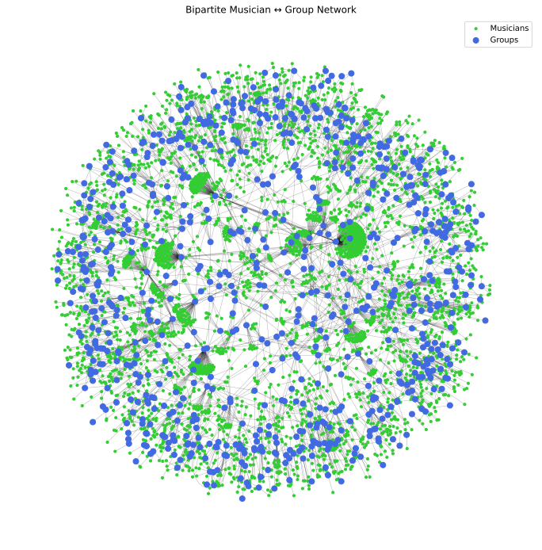
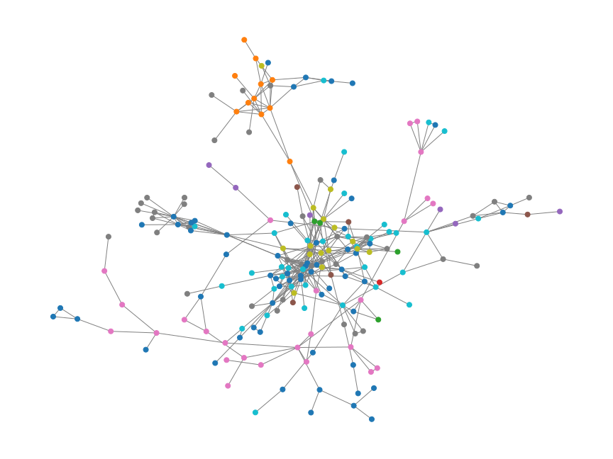
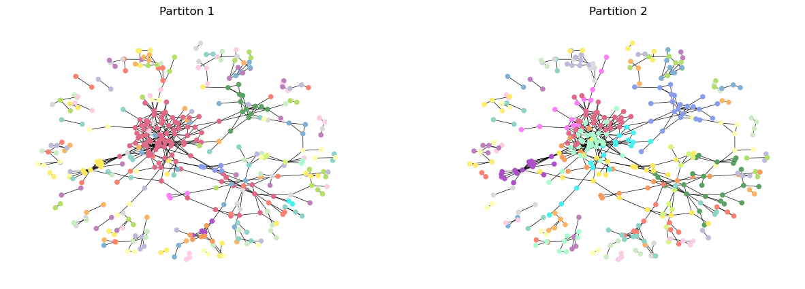
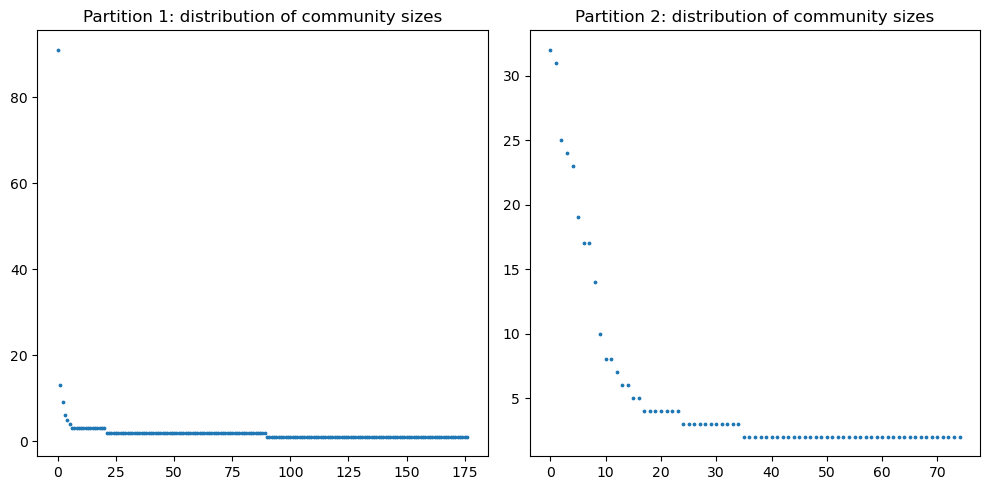
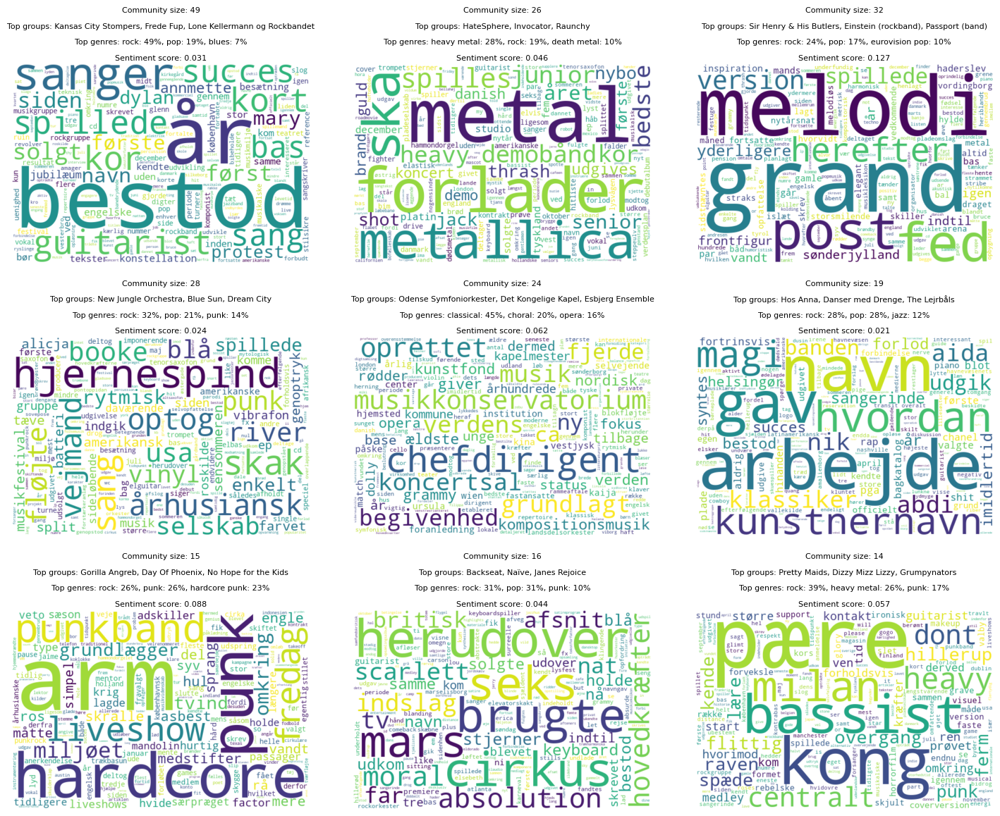

## Table of contents
- [Downloads](#downloads)
  - [The dataset](#the-dataset)
  - [The notebook](#the-notebook)
- [Introduction](#introduction)
- [The dataset](#the-dataset)
- [Network and text analysis](#network-and-text-analysis)
  - [Basic characteristics of the network](#basic-characteristics-of-the-network)
  - [Attribute analysis (genre)](#attribute-analysis-genre)
  - [Community detection](#community-detection)
 
## Downloads
### The dataset
You can download the raw CSV here:\
[⬇️ Download `musicians.csv`](/data/musicians.csv) \
Or take a look at here:\
[▶️ View `musicians.csv`](https://github.com/Aaresh1705/CSS_project_final/blob/main/data/musicians.csv)

### The notebook
You can download the notebook here:\
[⬇️ Download `final_notebook.ipynb`](assets/final_notebook.ipynb) \
Or take a look here:\
[▶️ View `final_notebook.ipynb`](https://github.com/Aaresh1705/CSS_project_final/blob/main/final_notebook.ipynb)

## Introduction

For this assignment, we investigate the structure of Denmark’s local music scene, by building a network that connects musicians to the music groups they play in. 

Our goal is to uncover patterns of collaboration, reveal how creative communities form, and perhaps highlight key individuals and groups that act as bridges across different scenes or genres.

To do this, we constructed a bipartite network - a special kind of network made up of two different types of nodes: musicians and groups (see model). 
In our network, musicians are only connected to groups (and not to other musicians directly), and groups are only connected to musicians. From this, we can create two useful projections: one where groups are linked if they share members, and another where musicians are linked if they’ve played in the same groups.

We collected data on Danish music groups by going through all relevant categories on the Danish Wikipedia, and gathered information about group members either from Wikipedia pages or the music database Discogs when needed. 
Once this data was cleaned and merged, we used it to build the network. For each music group we also fetched the intro text from their wikipedia articles and added a genre-attribute.

Focusing on Denmark keeps the scope of the project manageable while still offering meaningful insights. 
The final outcome is this interactive website, where you can explore how artists and groups are interconnected, as well as the explainer notebook with technical details which you can download above. 

This is our bipartite network, where to blue nodes are groups and green nodes are musicians:

## Network and text analysis
### Basic characteristics of the network
Below is shown an overview of the network properties. 
Click the links to go to the interactive plots of the networks.

| Network                                                                                      | Average degree               | Size |
|----------------------------------------------------------------------------------------------| ---------------------------- | ---- |
| [Danish Musicians (DM) network](assets/graphs/network.html) | 20.0                         | 4151 |
| [Danish Music Groups (DMG) network](assets/graphs/network.html)                              | 1.36                         | 814  |
| [Bipartite network](assets/graphs/bipartite.html)                                            | Musicians: 1.23  Groups: 5.84| 4931 |

**Danish Musicians Network:** \
The size is how many musicians there are in the network. The degree of a musician tells how many other musicians this musician has a shared music group with. The degree is thereby the number of links to other associated musicians.
The average degree is then the average of all degrees of musicians and tells something about how connected Danish musicians are. So, on average, one musician shares a music group or groups with 20 other musicians.

**The DMG network** \
The size is how many music groups there are in the network. The degree of a group tells how many other groups this group shares a musician with. The degree is thereby the number of links to other associated groups.
The average degree is then the average of all degrees of groups and tells something about how connected Danish musicians are. So, one music group shares one or more musicians with 1.36 other groups on average.

**Bipartite network** \
Here we have two average degrees, one for musicians and one for groups.  This should be interpreted as follows: On average a musician is a part of 1.23 music groups and on average a music group has 5.84 members.

**What is the structure of the projected networks?** \
We see in the interactive plots of the projected networks, some nodes (musicians or music groups) are connected very strongly around the middle. It seems as if the distribution degrees are not random. This is emphasized below for both projected networks, where the distributions are plotted against similar randomly generated networks. The degree distributions both seem to follow a heavy-tailed distribution, where a few nodes have very high degrees and most nodes have degrees below the average. This is a natural structure for social networks, among other things. Especially for the DMG network, we see the emergence of potential hubs in the lower right corner of the degree distribution plot. The largest potential hub group has 23 links and is the large jazz band “Kansas City Stompers”. However, the largest hub group is not guaranteed to be the most central one. Centrality is a more robust measure as it also relies on how connected the linking music groups are (and the links of the linking music groups, and so on). We found that the most central music groups of the DMG network are mostly old Danish bands popular in the 70s and 80s. The most central band is the rock group “Lone Kellermann & Rockbandet”, hence it is not the largest hub. It is a bit surprising that these groups are the most central, given our initial understanding of the music scene. However, since we use Wikipedia articles across time periods it might make sense that the network is biased towards older music groups. 

**Small-world Property** \
The small-world property describes a type of network where most nodes (musicians) are not directly connected to each other, but can still be reached through a surprisingly small number of steps. We thought it was most interesting and relatable to look at the musicians network. Here we found high clustering of musicians and low average shortest paths in the largest connected grouping of musicians in the network. This strongly suggests that the largest grouping in the musicians' network has the small-world property and that the music scene is very interconnected.

In our continued network analysis, we will mainly focus on the Danish Music Groups (DMG) network to narrow the scope and enable a more in-depth exploration. This is mainly because music groups also will be the focus of our text analysis. Very few musicians (of famous bands even) don’t have a wikipedia article, although fairly unknown bands have.

### Attribute analysis genre
In this section, we examine how the connections between music groups align with their musical genres. Since bands often span multiple genres, we use a similarity measure that reflects how much of their genre profiles overlap. Specifically, we calculate the proportion of shared genres between two bands relative to the total number of genres they each belong to (called jaccard similarity).

We found that the average genre similarity between connected music groups—those that share at least one member—is significantly higher than the global average similarity between all music groups in the dataset.

This suggests that musicians tend to collaborate within similar musical styles, leading to genre-based clustering in the network. In other words, bands that share members are more likely to be stylistically aligned, reinforcing the idea that creative communities often form around shared musical identities. 

Revisiting the plotted DMG network (link above), we see a clear example of this: a nearly isolated cluster at the bottom of the central component primarily consists of the genres “classical” and “choral”, which are closely related. Meanwhile, the densely connected core of the network is dominated by more mainstream and cross-collaborative genres such as “rock” and “pop”, reflecting their central role in the broader music scene.

Surprisingly, “jazz” is also very present in this central area, suggesting that jazz musicians frequently collaborate with more popular genre bands. This may be due to the relatively small size of the Danish music scene, where musicians often span multiple genres, and because performing with more mainstream acts may offer greater financial opportunities for jazz musicians.

Notably, one music group,“Sønderjyllands Symfoniorkestra”, serves as the only connection between the “classical/choral” cluster and the “rock/pop/jazz” cluster. This indicates that cross-genre collaboration between these otherwise separate musical communities is rare and it could be an interesting music group to look into for further investigation.

### Community detection
Below two different partitions of the DMG network is shown, along with their modularity, which is a measure of how well a partition divides a network into community, ranging from -1 to 1. Furthermore as seen below, partition 1 finds one big community containing 91 groups, and a lot of smaller ones (mostly of size 2 and 3), whereas partition 2 finds communities with sizes much more evenly distributed. As we want to find bigger patterns in the connections between music groups, we care about having more communities of bigger size. For further analysis we have therefore focused on partition 2. 

We have made a text analysis based on the introduction text of each groups Wikipedia page. The below plot shows the most characteristic words for the biggest 9 communities, as well as the most connected groups, top genres and a sentiment score, reflecting whether the text is more positive or negative.

It can be seen that there is quite a difference between the communities. The biggest community have rock as its primary genre and contain generic music words as "singer", "guitarist", "choir", "song", "playing" as well as "succes", "selling", which might indicate that the community contain well-known rockbands. The second is primarily heavy metal, the third consists of bands from Eurovision Song Contest ("Melodi Grand Prix" in danish). The fifth is all the classical symphony orchestras, which is supported by the wordcloud containing words like "music conservatory", "chief conductor" and "concert hall". 

Some of the other communities are a little harder to interpret, though the combination of genres can be see to differ. Overall it seems like genre is quite a defining factor for how musicians are members of groups. This is not unexpected though as musicians typically will have proficiency in playing in a given genre, and thus participates in groups who play that genre. 

This though, doesn't mean that no musicians overlap in genres. The network is quite connected and have a giant component containing aroud 500 groups - much larger than any individual community.

