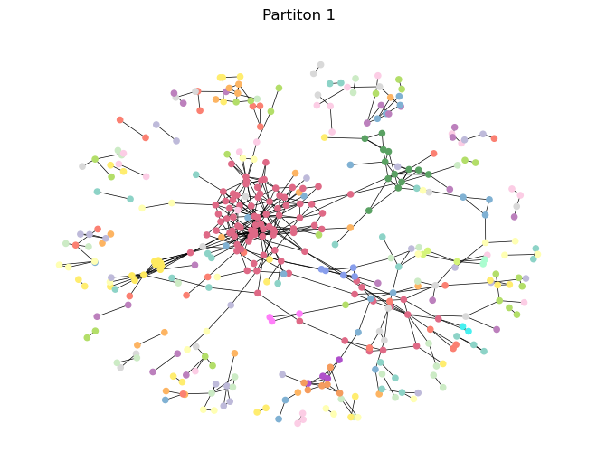

#  More about the website

 This part of the assignment is quite free. The main point of the website is to present your idea/analyses to the world in a way that showcases your use of what you've learned in class. It can be as simple as an old fashioned static web-page, and as complicated as you want it to be. Let your creativity run wild (but keep in mind that this is not a coding class - we care mostly about content and analysis). 

 The website should be self-contained and tell the story of your dataset without the need for the Explainer Notebook (the purpose of the notebook is to provide additional details for interested readers). Here are some requirements 

- [ ]  The page should say clearly what the dataset is and give the reader some idea of its most important properties (kind of Project Assignment A-style).
- [ ]  The page should contain your network and text analysis (that's the main part).
- [x]  There should be download options for data sets (so the user can play around).
- [x]  You must link to the Explainer Notebook (more details below) that explains the details of your analysis (including all of the machine learning, the model selection, etc). You can achieve this with a link to a notebook displaying on the nbviewer.
- [X]  For hosting, I recommend using your DTU website or Github pages.

## Table of contents
- [Introduction](#introduction)
- [The dataset](#the-dataset)
- [Network and text analysis](#network-and-text-analysis)
  - [Basic characteristics of the network](#basic-characteristics-of-the-network)
  - [Attribute analysis (genre)](#attribute-analysis-genre)
  - [Community detection](#community-detection)

## Introduction

For this assignment, we investigate the structure of Denmark’s local music scene, by building a network that connects musicians to the music groups they play in. 

Our goal is to uncover patterns of collaboration, reveal how creative communities form, and perhaps highlight key individuals and groups that act as bridges across different scenes or genres.

To do this, we constructed a bipartite network - a special kind of network made up of two different types of nodes: musicians and groups (see model). 
In our network, musicians are only connected to groups (and not to other musicians directly), and groups are only connected to musicians. From this, we can create two useful projections: one where groups are linked if they share members, and another where musicians are linked if they’ve played in the same groups.

We collected data on Danish music groups by going through all relevant categories on the Danish Wikipedia, and gathered information about group members either from Wikipedia pages or the music database Discogs when needed. 
Once this data was cleaned and merged, we used it to build the network. For each music group we also fetched the intro text from their wikipedia articles and added a genre-attribute.

Focusing on Denmark keeps the scope of the project manageable while still offering meaningful insights. 
The final outcome is this interactive website, where you can explore how artists and groups are interconnected, as well as the explainer notebook with technical details which you can download below. 

## Network and text analysis
### Basic characteristics of the network
Below is shown an overview of the network properties. 
Click the links to go to the interactive plots of the networks.

| Network                                                                                      | Average degree               | Size |
|----------------------------------------------------------------------------------------------| ---------------------------- | ---- |
| [Danish Musicians (DM) network](assets/graphs/network.html) | 20.0                         | 4151 |
| [Danish Music Groups (DMG) network](assets/graphs/network.html)                              | 1.36                         | 814  |
| [Bipartite network](assets/graphs/bipartite.html)                                            | Musicians: 1.23  Groups: 5.84| 4931 |

### Attribute analysis genre
### Community detection
Below two different partitions of the DMG network is shown. 

## Live Graphs

- [Local Music Community Network](assets/graphs/network.html)  
- [Rotatable 3D Plot](assets/graphs/rotatable_plot.html)  

## Downloads
### The dataset
You can download the raw CSV here:\
[⬇️ Download `musicians.csv`](/data/musicians.csv)

Or take a look at here:\
[▶️ View `musicians.csv`](https://github.com/Aaresh1705/CSS_project_final/blob/main/data/musicians.csv)

### The notebook
You can download the notebook here:\
[⬇️ Download `final_notebook.ipynb`](assets/final_notebook.ipynb)

Or take a look here:\
[▶️ View `final_notebook.ipynb`](https://github.com/Aaresh1705/CSS_project_final/blob/main/final_notebook.ipynb)
